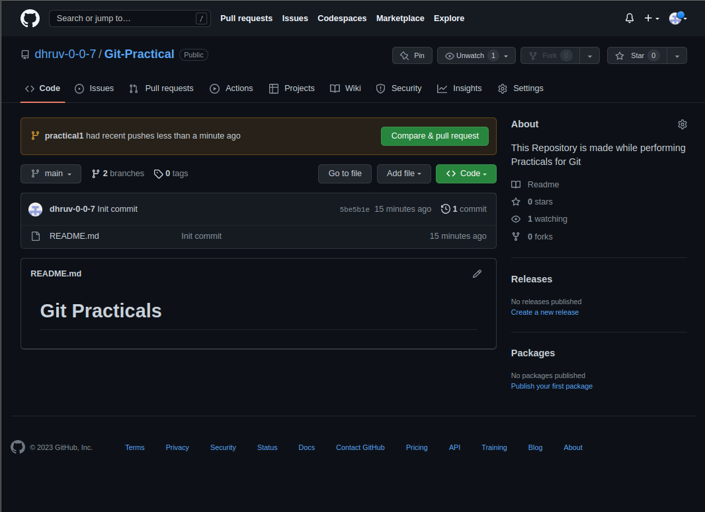
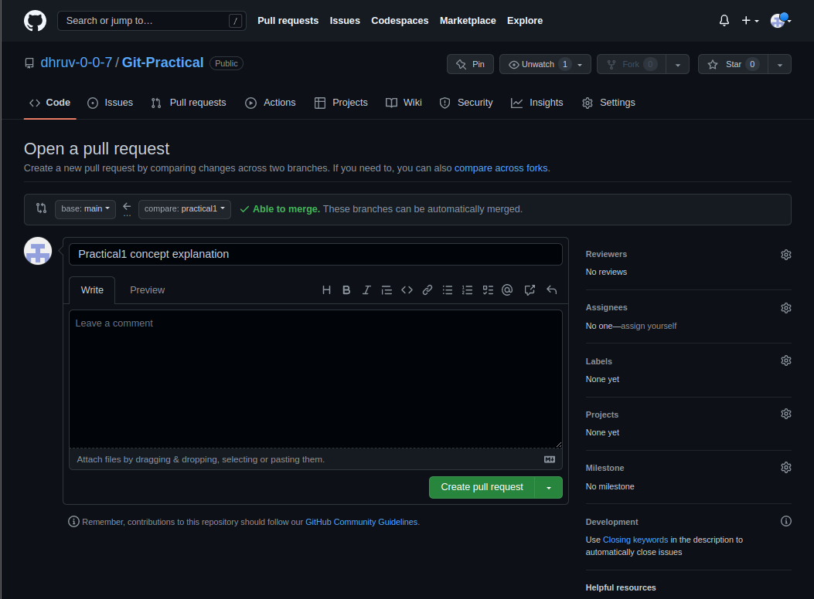
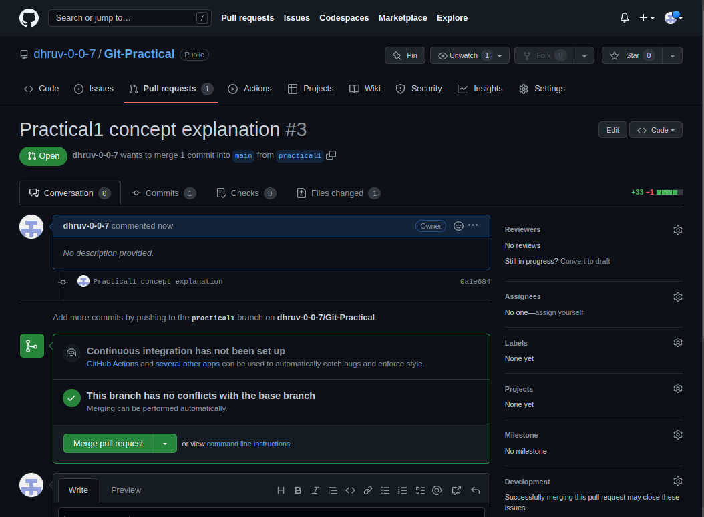
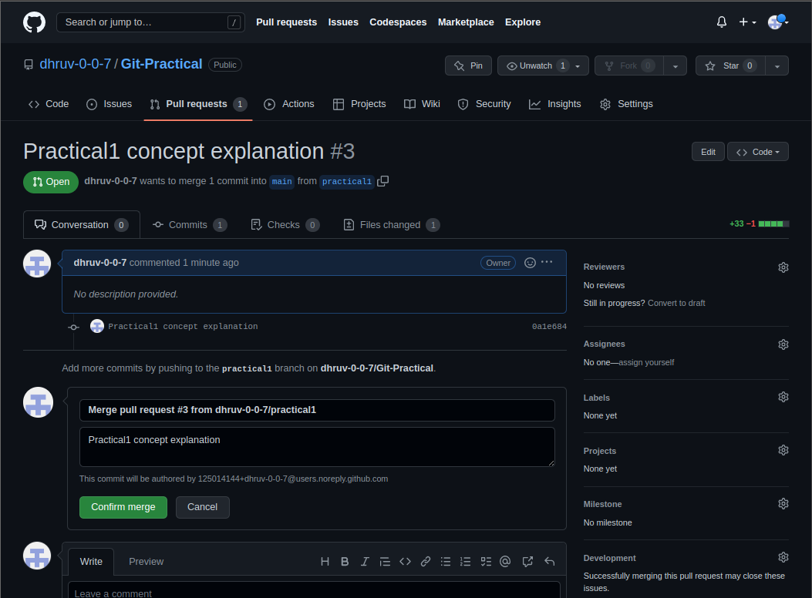
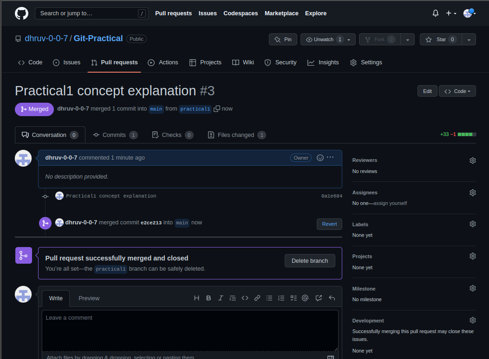
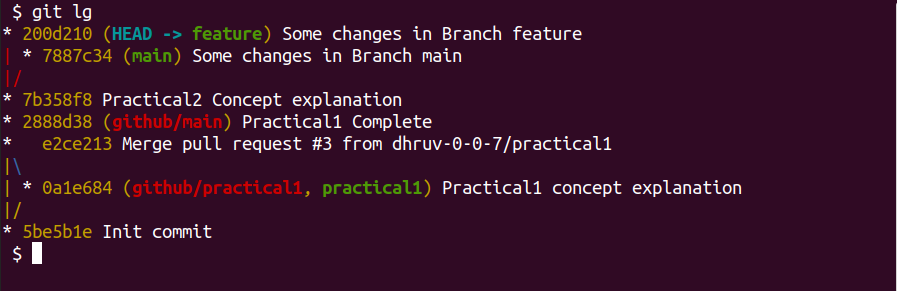
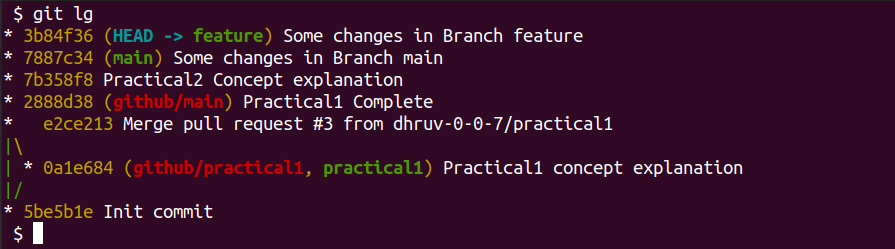

# Git Practicals

### (1) Pull and Merge Difference

- Pull Request: 

Pull Request or (Merge Request) is a feature provided by Git Hosting platform such as (Github, Gitlab, etc...) to Merge changes on Remote Repository. PR is generated basically so that any higher authority or owner of Repository or even we can verify the changes before we confirm the merge.

- Pulling changes from Remote Repository:

In order to keep our Local Repository in-sync with Remote Repository we perform Pulling operation using `git pull` command, to pull changes from Remote Repository into the Local Repository. `git pull` is a Network Operation and It will **fetch** hashes of changes and **merge** them with the equivalent branch.

- Merging Branches:

Merging is as the name suggests, an operation performed to merge/combine changes of two branches. we use `git merge` command to perform this operation.

- Creating Pull Request and Merging two branches.

Create branch and commit some changes locally on the new Branch...

```bash
git branch practical1
git switch practical1

# Made some changes and staging all changes
git add .

# Create a commit
git commit -m "Concept explanation for Practical1"

# Pushing new changes on github/practical1
git push github practical1
```
Remote Repository Scenario,



  







### (2) Rebase

- Rebase operation is performed to change the base of branch. Rebase is typically used to make Commit History Linear. We use `git rebase` command.
- Interactive Rebasing is used to manipulate Commit history in more flexible way.

- Try to Rebase feature Branch with main Branch

```bash
# Create feature branch
git branch feature

# Made some changes in -main- Branch and Staging all changes
git add .

# Commiting changes
git commit -m "Some changes in Branch main"

# Switch to feature branch
git switch feature

# Made some changes in -feature- Branch and Staging all changes
git add .

# Commiting changes
git commit -m "Some changes in Branch feature"

```



```bash
# Performing Rebase operation
# Switch to feature branch
git switch feature

# Rebase with Branch main
git rebase main
```


### (3) Change Commit Message

- To change Commit Message we can perform Interactive Rebasing. We can use option `reword` for particular commit Id to change its Message. We use `git rebase -i` command for Interactive Rebasing. Changing Commit Message is one of the Operations that will *rewrite* the Commit History. So, after changing Commit Message, we'll be required to Push our Changes **forcefully** if the commits we edited were already on Remote Repository. Also, the commits we edit are already cloned by other team members then, Rewriting the Commit history will require for them to Pull new changes before they push their changes on Remote Repository. This way we can change any Commit's Message.

- To change last Commit's Message we can use `--amend` option in `git commit` and provide a new message with `-m` option. Amend operation is used to append changes to last Commit instead of creating a new commit.

```bash
# Made some changes and Creating commit
git add .
git commit -m "Commit message should be changed"
```